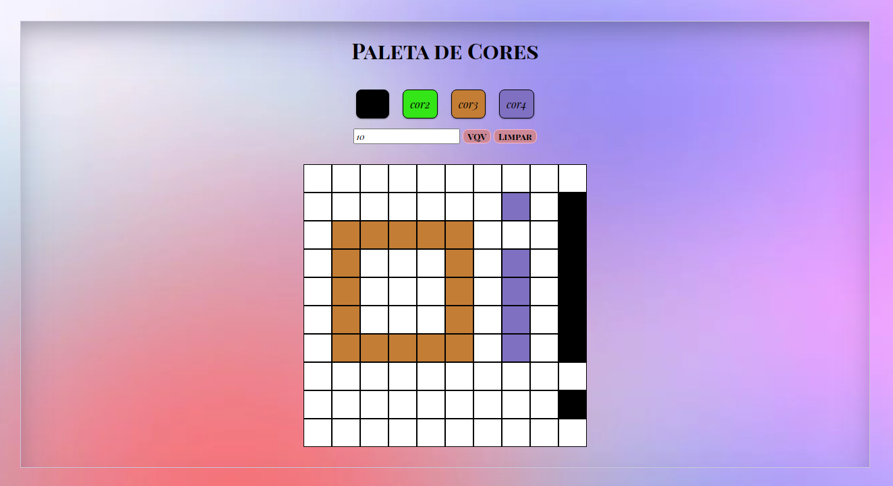
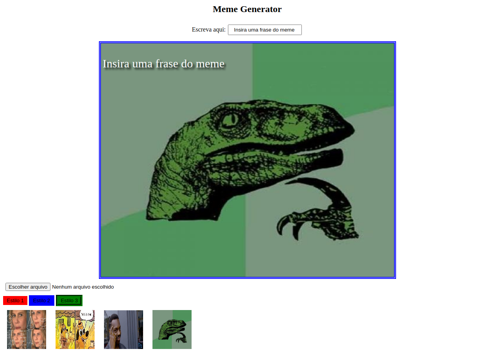
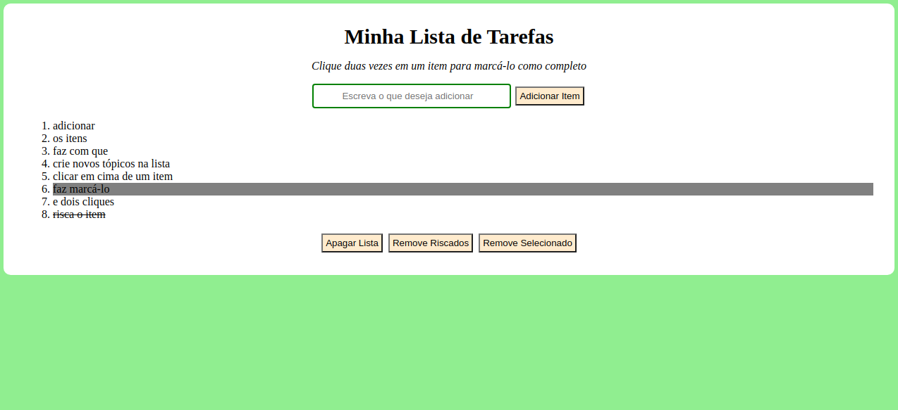
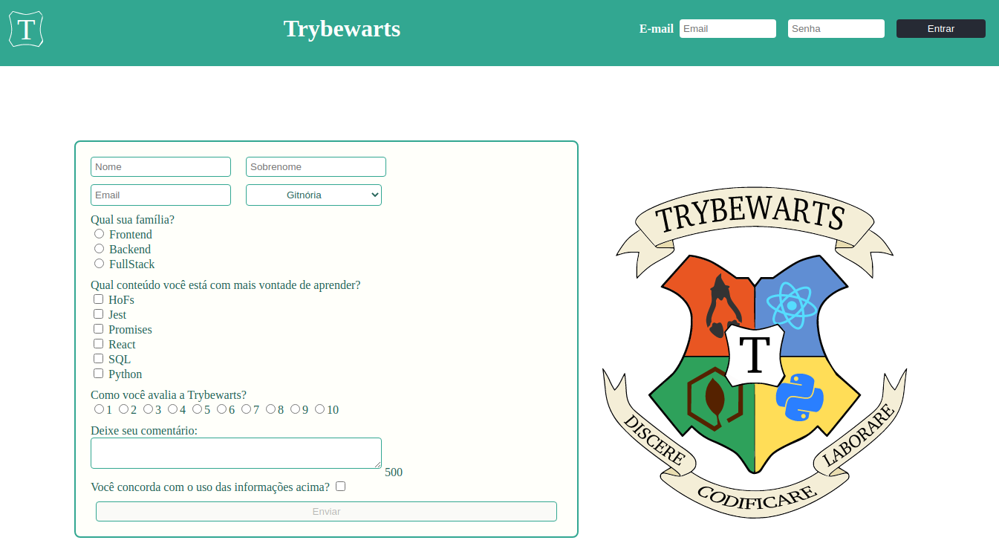

<h2> Sobre essa Pasta: </h2>

 Abaixo segue os projetos <b>Front-End</b> elaborados durante meus estudos  
Clique na imagem para que você seja direcionado para o repositório correspondente a cada um dos projetos

<h3> Projeto Pixels Arte </h3>

 HTML - CSS - JavaScript 

<h3> Projeto Gerador de Memes </h3>

 HTML - CSS - JavaScript 

<h3> Projeto To-do List </h3>

 HTML - CSS - JavaScript 

<h3> Projeto TrybeWarts</h3>

 HTML - CSS - JavaScript 

<h3> Projeto Trybe Wallet </h3>

 HTML - CSS - JavaScript - React 

<h3> Projeto Star-Wars </h3>

